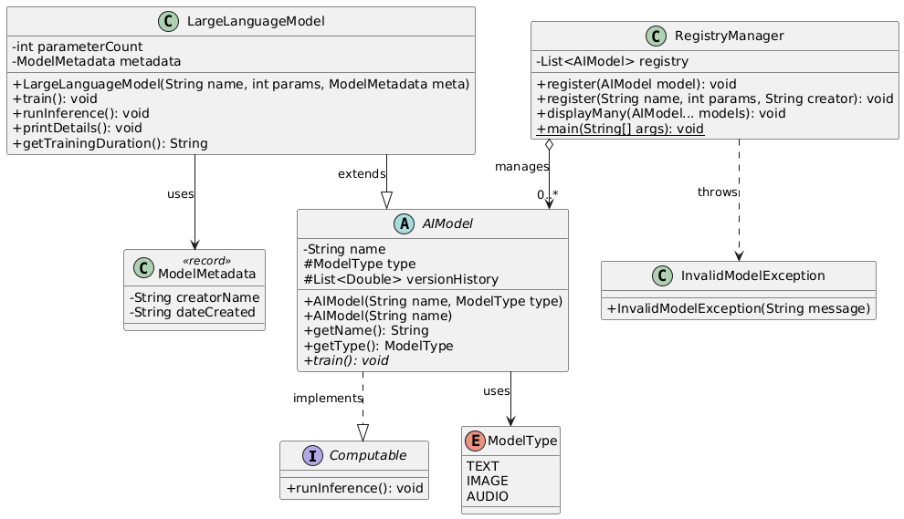

# AI Model Registry

## What We Are Doing
We are building a simple **AI Model Registry** using Java. This program helps us organize and track different AI models (like GPT-4, Claude, and Gemini) in a list.

It demonstrates modern Java features like:
*   **Records** (for metadata)
*   **Method Overloading** (to register models in different ways)
*   **Switch Expressions** (to check training duration)
*   **Exception Handling** (to catch errors)

## How Data is Displayed
The program runs in the console (terminal).

1.  **Registration**: It confirms when a model is added.
2.  **Display**: It lists the models we ask for.
3.  **Details**: It shows specific details like the model name and how long it takes to train.
4.  **Errors**: If we try to add a model with negative parameters, it shows a friendly error message.

### Sample Output
```text
--- AI Model Registry Starting ---
Registered: GPT-4
Registered via overloading: Llama-3
Displaying: GPT-4
Model: GPT-4 | Duration: 2 Weeks
Error: Parameters cannot be negative!
```

## UML Diagram

